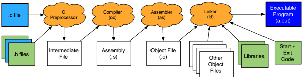

Reference: Writing, Running, and Fixing Code in C. Week 2. Compiler Details. Reading: Assembling.

Recall:

- The important thing to understand about this step is that it results in an **object file**.
- The object file contains the machine-executable instructions for the source file that you compiled, but is not yet a complete program.
- The object file may reference functions that it does not define (such as those in the C library, or those written in other files).
- You can request that gcc stop after it assembles an object file by specifying the `-c` option.
- By default, the name of the object file will be the name of the `.c` file with the `.c` replaced by `.o`.
- For example, `gcc -c xyz.c` will compile `xyz.c` into `xyz.o`.
- If you wish to provide a different name for the object file, use the `-o` option followed by the name you want.
- For example, `gcc -c xyz.c -o awesomeName.o` will produce an object file called `awesomeName.o`.