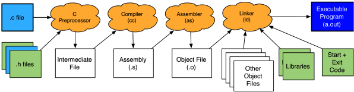

Reference: Writing, Running, and Fixing Code in C. Week 2. Introduction. Reading: Preprocessing.

The first step, in the upper left is the **preprocessor**
- takes your C source file and combines it with any **header** files that it includes
- expands any **macros** that you might have used

```c
#include <stdio.h>
#include <stdlib.h>

int main (void) {
  printf ("Hello World\n");
  return EXIT_SUCCESS;
}
```

The first two lines are `include` **directives**
- not actually statements which are executed when the program is run
- are directives to the preprocessor portion of the compiler
- tell the preprocessor to literally include the contents of the named file at that point in the program source, before passing it on to the later steps of the compilation process



These `#include` directives name the file to be included in angle brackets (`<>`) because that file is one of the standard C header files.

If you wrote your own header file, you would include it by placing its name in quotation marks (e.g., `#include "myHeader.h"`).

Header files primarily contain three things: **function prototypes**, macro definitions, and type declarations.
